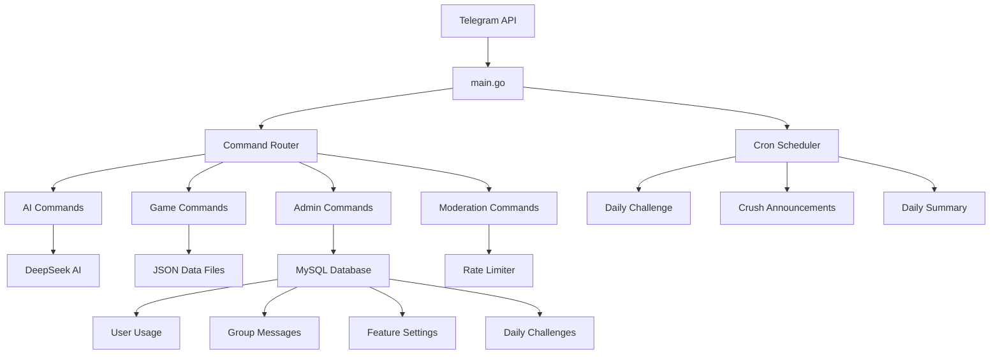

# 🔧 راهنمای توسعه - Covo Bot

## 📋 فهرست مطالب

- [🎯 مقدمه](#-مقدمه)
- [🏗️ معماری پروژه](#️-معماری-پروژه)
- [📁 ساختار کد](#-ساختار-کد)
- [🛠️ نحوه افزودن قابلیت جدید](#️-نحوه-افزودن-قابلیت-جدید)
- [🗄️ کار با پایگاه داده](#️-کار-با-پایگاه-داده)
- [🧪 تست کردن](#-تست-کردن)
- [📝 استانداردهای کدنویسی](#-استانداردهای-کدنویسی)
- [🔍 دیباگ](#-دیباگ)
- [📦 مدیریت وابستگی‌ها](#-مدیریت-وابستگی‌ها)
- [🚀 استقرار](#-استقرار)

---

## 🎯 مقدمه

این راهنما برای توسعه‌دهندگانی است که می‌خواهند در پروژه Covo Bot مشارکت کنند یا قابلیت‌های جدیدی اضافه کنند.

### 📚 **پیش‌نیازها**

- آشنایی با زبان Go
- آشنایی با Telegram Bot API
- آشنایی با MySQL
- آشنایی با Git
- آشنایی با REST APIs

---

## 🏗️ معماری پروژه

### 🔄 **نمودار جریان داده**



### 🧩 **الگوهای طراحی استفاده شده**

#### **Command Pattern**
```go
type Command interface {
    Handle(update tgbotapi.Update) tgbotapi.MessageConfig
}
```

#### **Repository Pattern**
```go
type Storage interface {
    GetUserUsage(userID int64) (*UserUsage, error)
    AddGroupMessage(groupID int64, userID int64, username, message string) error
    // ...
}
```

#### **Factory Pattern**
```go
func NewCovoBot() (*CovoBot, error) {
    // ایجاد و پیکربندی تمام اجزا
}
```

---

## 📁 ساختار کد

### 🗂️ **سازماندهی فایل‌ها**

```
Covo_Chat/
├── main.go                    # نقطه ورود اصلی
├── config/                    # مدیریت تنظیمات
│   └── env.go                # متغیرهای محیطی
├── commands/                  # دستورات بات
│   ├── admin.go              # مدیریت ادمین
│   ├── clown.go              # قابلیت دلقک
│   ├── covo.go               # دستور اصلی AI
│   ├── crush.go              # قابلیت کراش
│   ├── daily_challenge.go    # چلنج روزانه
│   ├── gap.go                # پنل مدیریت
│   ├── hafez.go              # فال حافظ
│   ├── moderation.go         # مدیریت گروه
│   ├── music.go              # پیشنهاد موسیقی
│   ├── redhat.go             # دستور اصلی (legacy)
│   ├── rrs.go                # وضعیت بات
│   ├── rtj.go                # تولید جوک
│   ├── tag.go                # تگ کردن
│   └── truthdare.go          # بازی جرات یا حقیقت
├── storage/                   # لایه ذخیره‌سازی
│   ├── mysql.go              # پایگاه داده MySQL
│   └── memory.go             # ذخیره‌سازی حافظه (غیرفعال)
├── ai/                        # ادغام هوش مصنوعی
│   └── openai.go             # کلاینت DeepSeek
├── limiter/                   # محدودیت درخواست
│   └── rate_limiter.go       # سیستم Rate Limiting
├── scheduler/                 # زمان‌بندی
│   └── daily_summary.go      # خلاصه روزانه
└── jsonfile/                  # فایل‌های داده
    ├── badwords.json         # کلمات نامناسب
    ├── clown.json            # متن‌های دلقک
    ├── dare.json             # چالش‌های جرات
    ├── fal.json              # فال‌های حافظ
    ├── truth+18.json         # سوالات +18
    └── zarb.json             # ضرب‌المثل‌ها
```

### 🎯 **اصول طراحی**

#### **Separation of Concerns**
- هر فایل مسئولیت مشخصی دارد
- منطق کسب‌وکار از لایه ذخیره‌سازی جدا است
- دستورات از یکدیگر مستقل هستند

#### **Single Responsibility Principle**
- هر کلاس/فایل یک مسئولیت دارد
- تغییرات در یک بخش، بخش‌های دیگر را تحت تأثیر قرار نمی‌دهد

#### **Dependency Injection**
```go
func NewCovoCommand(aiClient *ai.DeepSeekClient, rateLimiter *limiter.RateLimiter, bot *tgbotapi.BotAPI) *CovoCommand {
    return &CovoCommand{
        aiClient:    aiClient,
        rateLimiter: rateLimiter,
        bot:         bot,
    }
}
```

---

## 🛠️ نحوه افزودن قابلیت جدید

### 📝 **مراحل کلی**

#### 1️⃣ **برنامه‌ریزی**
- نیازمندی‌ها را تعریف کنید
- رابط کاربری را طراحی کنید
- ساختار داده‌ها را مشخص کنید

#### 2️⃣ **ایجاد فایل دستور**
```go
// commands/new_feature.go
package commands

import (
    "redhat-bot/storage"
    tgbotapi "github.com/go-telegram-bot-api/telegram-bot-api/v5"
)

type NewFeatureCommand struct {
    bot     *tgbotapi.BotAPI
    storage *storage.MySQLStorage
}

func NewNewFeatureCommand(bot *tgbotapi.BotAPI, storage *storage.MySQLStorage) *NewFeatureCommand {
    return &NewFeatureCommand{
        bot:     bot,
        storage: storage,
    }
}

func (c *NewFeatureCommand) Handle(update tgbotapi.Update) tgbotapi.MessageConfig {
    chatID := update.Message.Chat.ID
    userID := update.Message.From.ID
    
    // منطق دستور
    response := "پاسخ دستور جدید"
    
    msg := tgbotapi.NewMessage(chatID, response)
    msg.ParseMode = tgbotapi.ModeMarkdown
    return msg
}
```

#### 3️⃣ **اضافه کردن به main.go**
```go
// در NewCovoBot()
newFeatureCommand := commands.NewNewFeatureCommand(bot, storage)

// در CovoBot struct
type CovoBot struct {
    // ... سایر فیلدها
    newFeatureCommand *commands.NewFeatureCommand
}

// در handleUpdate()
case strings.HasPrefix(text, "/newfeature"):
    response = r.newFeatureCommand.Handle(update)
```

#### 4️⃣ **اضافه کردن به پنل مدیریت**
```go
// در commands/gap.go
case "new_feature":
    msg.Text = "قابلیت جدید فعال شد"
    // منطق فعال‌سازی
```

### 🎮 **مثال: افزودن بازی جدید**

#### **1. ایجاد فایل بازی**
```go
// commands/new_game.go
package commands

import (
    "math/rand"
    "time"
    tgbotapi "github.com/go-telegram-bot-api/telegram-bot-api/v5"
)

type NewGameCommand struct {
    bot     *tgbotapi.BotAPI
    storage *storage.MySQLStorage
    games   map[int64]*GameState // وضعیت بازی‌ها
}

type GameState struct {
    ChatID      int64
    PlayerID    int64
    Score       int
    IsActive    bool
    CreatedAt   time.Time
}

func NewNewGameCommand(bot *tgbotapi.BotAPI, storage *storage.MySQLStorage) *NewGameCommand {
    return &NewGameCommand{
        bot:     bot,
        storage: storage,
        games:   make(map[int64]*GameState),
    }
}

func (g *NewGameCommand) Handle(update tgbotapi.Update) tgbotapi.MessageConfig {
    chatID := update.Message.Chat.ID
    userID := update.Message.From.ID
    
    // بررسی وجود بازی فعال
    if game, exists := g.games[chatID]; exists && game.IsActive {
        return tgbotapi.NewMessage(chatID, "بازی در حال انجام است!")
    }
    
    // ایجاد بازی جدید
    game := &GameState{
        ChatID:    chatID,
        PlayerID:  userID,
        Score:     0,
        IsActive:  true,
        CreatedAt: time.Now(),
    }
    g.games[chatID] = game
    
    // ارسال پیام شروع بازی
    text := "🎮 بازی جدید شروع شد!\n\nنمره شما: 0\n\nبرای ادامه بازی /play را بزنید"
    msg := tgbotapi.NewMessage(chatID, text)
    msg.ParseMode = tgbotapi.ModeMarkdown
    return msg
}

func (g *NewGameCommand) HandlePlay(update tgbotapi.Update) tgbotapi.MessageConfig {
    chatID := update.Message.Chat.ID
    userID := update.Message.From.ID
    
    game, exists := g.games[chatID]
    if !exists || !game.IsActive {
        return tgbotapi.NewMessage(chatID, "هیچ بازی فعالی وجود ندارد!")
    }
    
    if game.PlayerID != userID {
        return tgbotapi.NewMessage(chatID, "این بازی شما نیست!")
    }
    
    // منطق بازی
    game.Score += rand.Intn(10) + 1
    
    text := fmt.Sprintf("🎯 نمره شما: %d\n\nبرای ادامه /play را بزنید", game.Score)
    msg := tgbotapi.NewMessage(chatID, text)
    msg.ParseMode = tgbotapi.ModeMarkdown
    return msg
}
```

#### **2. اضافه کردن به main.go**
```go
// در NewCovoBot()
newGameCommand := commands.NewNewGameCommand(bot, storage)

// در CovoBot struct
type CovoBot struct {
    // ... سایر فیلدها
    newGameCommand *commands.NewGameCommand
}

// در handleUpdate()
case strings.HasPrefix(text, "/newgame"):
    response = r.newGameCommand.Handle(update)
case strings.HasPrefix(text, "/play"):
    response = r.newGameCommand.HandlePlay(update)
```

---

## 🗄️ کار با پایگاه داده

### 📊 **اضافه کردن جدول جدید**

#### **1. تعریف مدل**
```go
// storage/mysql.go
type NewTable struct {
    ID        uint      `gorm:"primaryKey"`
    Name      string    `gorm:"type:varchar(255);not null"`
    Value     int       `gorm:"default:0"`
    CreatedAt time.Time `gorm:"autoCreateTime"`
    UpdatedAt time.Time `gorm:"autoUpdateTime"`
}
```

#### **2. اضافه کردن به AutoMigrate**
```go
// در NewMySQLStorage()
if err := db.AutoMigrate(&NewTable{}); err != nil {
    return nil, fmt.Errorf("error migrating NewTable: %v", err)
}
```

#### **3. اضافه کردن متدهای CRUD**
```go
// storage/mysql.go
func (m *MySQLStorage) CreateNewTable(nt *NewTable) error {
    return m.db.Create(nt).Error
}

func (m *MySQLStorage) GetNewTableByID(id uint) (*NewTable, error) {
    var nt NewTable
    err := m.db.First(&nt, id).Error
    if err != nil {
        return nil, err
    }
    return &nt, nil
}

func (m *MySQLStorage) UpdateNewTable(nt *NewTable) error {
    return m.db.Save(nt).Error
}

func (m *MySQLStorage) DeleteNewTable(id uint) error {
    return m.db.Delete(&NewTable{}, id).Error
}

func (m *MySQLStorage) ListNewTables(limit, offset int) ([]NewTable, error) {
    var tables []NewTable
    err := m.db.Limit(limit).Offset(offset).Find(&tables).Error
    return tables, err
}
```

### 🔍 **Query های پیچیده**

#### **Join کردن جداول**
```go
func (m *MySQLStorage) GetUserStatsWithMessages(userID int64) ([]UserStats, error) {
    var stats []UserStats
    err := m.db.Table("users").
        Select("users.id, users.name, COUNT(group_messages.id) as message_count").
        Joins("LEFT JOIN group_messages ON users.id = group_messages.user_id").
        Where("users.id = ?", userID).
        Group("users.id").
        Scan(&stats).Error
    return stats, err
}
```

#### **Aggregation**
```go
func (m *MySQLStorage) GetDailyStats(date time.Time) (*DailyStats, error) {
    var stats DailyStats
    startOfDay := time.Date(date.Year(), date.Month(), date.Day(), 0, 0, 0, 0, date.Location())
    endOfDay := startOfDay.Add(24 * time.Hour)
    
    err := m.db.Table("group_messages").
        Select("COUNT(*) as total_messages, COUNT(DISTINCT user_id) as unique_users").
        Where("timestamp BETWEEN ? AND ?", startOfDay, endOfDay).
        Scan(&stats).Error
    return &stats, err
}
```

---

## 🧪 تست کردن

### 🔬 **نحوه نوشتن تست**

#### **1. ایجاد فایل تست**
```go
// commands/new_feature_test.go
package commands

import (
    "testing"
    "redhat-bot/storage"
    tgbotapi "github.com/go-telegram-bot-api/telegram-bot-api/v5"
)

func TestNewFeatureCommand_Handle(t *testing.T) {
    // Setup
    bot := &tgbotapi.BotAPI{} // Mock bot
    storage := &storage.MySQLStorage{} // Mock storage
    cmd := NewNewFeatureCommand(bot, storage)
    
    // Test data
    update := tgbotapi.Update{
        Message: &tgbotapi.Message{
            Chat: &tgbotapi.Chat{ID: 12345},
            From: &tgbotapi.User{ID: 67890},
            Text: "/newfeature test",
        },
    }
    
    // Execute
    result := cmd.Handle(update)
    
    // Assert
    if result.ChatID != 12345 {
        t.Errorf("Expected ChatID 12345, got %d", result.ChatID)
    }
    
    if result.Text == "" {
        t.Error("Expected non-empty response text")
    }
}
```

#### **2. تست‌های Integration**
```go
func TestNewFeatureCommand_Integration(t *testing.T) {
    // Setup database
    db := setupTestDB(t)
    defer cleanupTestDB(t, db)
    
    // Setup command
    cmd := NewNewFeatureCommand(mockBot, db)
    
    // Test full flow
    update := createTestUpdate("/newfeature test")
    result := cmd.Handle(update)
    
    // Verify database state
    var count int64
    db.Model(&NewTable{}).Count(&count)
    if count != 1 {
        t.Errorf("Expected 1 record, got %d", count)
    }
}
```

#### **3. تست‌های Performance**
```go
func BenchmarkNewFeatureCommand_Handle(b *testing.B) {
    cmd := setupTestCommand()
    update := createTestUpdate("/newfeature test")
    
    b.ResetTimer()
    for i := 0; i < b.N; i++ {
        cmd.Handle(update)
    }
}
```

### 🚀 **اجرای تست‌ها**

```bash
# اجرای تمام تست‌ها
go test ./...

# اجرای تست‌های یک پکیج
go test ./commands

# اجرای تست با coverage
go test -cover ./...

# اجرای تست‌های performance
go test -bench=. ./...

# اجرای تست‌های race condition
go test -race ./...
```

---

## 📝 استانداردهای کدنویسی

### 🎯 **نام‌گذاری**

#### **متغیرها و توابع**
```go
// ✅ درست
var userID int64
var messageText string
func GetUserByID(id int64) (*User, error)

// ❌ نادرست
var user_id int64
var message_text string
func getUserById(id int64) (*User, error)
```

#### **ساختارها و اینترفیس‌ها**
```go
// ✅ درست
type UserCommand struct {
    bot     *tgbotapi.BotAPI
    storage *storage.MySQLStorage
}

type CommandHandler interface {
    Handle(update tgbotapi.Update) tgbotapi.MessageConfig
}

// ❌ نادرست
type userCommand struct {
    bot     *tgbotapi.BotAPI
    storage *storage.MySQLStorage
}
```

### 📚 **کامنت‌ها**

#### **کامنت‌های توابع**
```go
// Handle processes incoming messages and returns appropriate response
// It checks user permissions, validates input, and executes command logic
func (c *Command) Handle(update tgbotapi.Update) tgbotapi.MessageConfig {
    // Implementation
}
```

#### **کامنت‌های پیچیده**
```go
// Process user input and generate AI response
// This function:
// 1. Validates user input
// 2. Checks rate limits
// 3. Calls AI service
// 4. Formats response
func (c *AICommand) processUserInput(input string) (string, error) {
    // Implementation
}
```

### 🔧 **Error Handling**

```go
// ✅ درست
func (s *Storage) GetUser(id int64) (*User, error) {
    var user User
    err := s.db.First(&user, id).Error
    if err != nil {
        if errors.Is(err, gorm.ErrRecordNotFound) {
            return nil, fmt.Errorf("user with id %d not found", id)
        }
        return nil, fmt.Errorf("failed to get user: %w", err)
    }
    return &user, nil
}

// ❌ نادرست
func (s *Storage) GetUser(id int64) (*User, error) {
    var user User
    err := s.db.First(&user, id).Error
    if err != nil {
        return nil, err
    }
    return &user, nil
}
```

### 🧹 **کد تمیز**

#### **توابع کوتاه و متمرکز**
```go
// ✅ درست
func (c *Command) Handle(update tgbotapi.Update) tgbotapi.MessageConfig {
    if !c.validateInput(update) {
        return c.createErrorResponse("Invalid input")
    }
    
    if !c.checkPermissions(update) {
        return c.createPermissionErrorResponse()
    }
    
    return c.executeCommand(update)
}

// ❌ نادرست
func (c *Command) Handle(update tgbotapi.Update) tgbotapi.MessageConfig {
    // 100+ lines of mixed logic
}
```

---

## 🔍 دیباگ

### 🐛 **ابزارهای دیباگ**

#### **استفاده از log**
```go
import "log"

func (c *Command) Handle(update tgbotapi.Update) tgbotapi.MessageConfig {
    log.Printf("Processing command for user %d in chat %d", 
        update.Message.From.ID, update.Message.Chat.ID)
    
    // ... logic
    
    log.Printf("Command processed successfully")
    return result
}
```

#### **استفاده از debugger**
```go
// در VS Code یا GoLand
func (c *Command) Handle(update tgbotapi.Update) tgbotapi.MessageConfig {
    // Set breakpoint here
    userID := update.Message.From.ID
    chatID := update.Message.Chat.ID
    
    // Debug variables
    _ = userID
    _ = chatID
    
    // ... rest of logic
}
```

### 📊 **پروفایلینگ**

#### **استفاده از pprof**
```go
import _ "net/http/pprof"
import "net/http"

func main() {
    // Start pprof server
    go func() {
        log.Println(http.ListenAndServe("localhost:6060", nil))
    }()
    
    // ... rest of main
}
```

#### **تحلیل عملکرد**
```bash
# اجرای برنامه
go run main.go

# در ترمینال دیگر
go tool pprof http://localhost:6060/debug/pprof/profile
```

---

## 📦 مدیریت وابستگی‌ها

### 🔄 **افزودن وابستگی جدید**

```bash
# افزودن وابستگی
go get github.com/new/package@v1.2.3

# افزودن وابستگی توسعه
go get -d github.com/new/package@v1.2.3

# حذف وابستگی
go mod tidy
```

### 🔒 **قفل کردن نسخه‌ها**

```go
// go.mod
module redhat-bot

go 1.24.5

require (
    github.com/go-telegram-bot-api/telegram-bot-api/v5 v5.5.1
    github.com/new/package v1.2.3
)
```

### 🔄 **به‌روزرسانی وابستگی‌ها**

```bash
# به‌روزرسانی تمام وابستگی‌ها
go get -u ./...

# به‌روزرسانی وابستگی خاص
go get -u github.com/package/name

# بررسی وابستگی‌های منسوخ
go list -u -m all
```

---

## 🚀 استقرار

### 🏭 **Production Build**

```bash
# Build برای production
go build -ldflags="-s -w" -o covo-bot main.go

# Build برای سیستم‌های مختلف
GOOS=linux GOARCH=amd64 go build -ldflags="-s -w" -o covo-bot-linux main.go
GOOS=windows GOARCH=amd64 go build -ldflags="-s -w" -o covo-bot.exe main.go
GOOS=darwin GOARCH=amd64 go build -ldflags="-s -w" -o covo-bot-mac main.go
```

### 🐳 **Docker**

```dockerfile
# Dockerfile
FROM golang:1.24.5-alpine AS builder
WORKDIR /app
COPY . .
RUN go mod download
RUN go build -ldflags="-s -w" -o covo-bot main.go

FROM alpine:latest
RUN apk --no-cache add ca-certificates
WORKDIR /root/
COPY --from=builder /app/covo-bot .
COPY --from=builder /app/jsonfile ./jsonfile
CMD ["./covo-bot"]
```

```bash
# Build Docker image
docker build -t covo-bot .

# Run container
docker run -d --name covo-bot --env-file .env covo-bot
```

### 🔄 **CI/CD**

```yaml
# .github/workflows/ci.yml
name: CI/CD Pipeline

on:
  push:
    branches: [ main, develop ]
  pull_request:
    branches: [ main ]

jobs:
  test:
    runs-on: ubuntu-latest
    steps:
    - uses: actions/checkout@v3
    - uses: actions/setup-go@v3
      with:
        go-version: 1.24.5
    - run: go mod download
    - run: go test ./...
    - run: go build -o covo-bot main.go

  deploy:
    needs: test
    runs-on: ubuntu-latest
    if: github.ref == 'refs/heads/main'
    steps:
    - uses: actions/checkout@v3
    - name: Deploy to production
      run: |
        # Deploy script
        echo "Deploying to production..."
```

---

## 📚 منابع مفید

### 📖 **مستندات**
- [Go Documentation](https://golang.org/doc/)
- [Telegram Bot API](https://core.telegram.org/bots/api)
- [GORM Documentation](https://gorm.io/docs/)
- [MySQL Documentation](https://dev.mysql.com/doc/)

### 🛠️ **ابزارها**
- [VS Code Go Extension](https://marketplace.visualstudio.com/items?itemName=golang.Go)
- [GoLand IDE](https://www.jetbrains.com/go/)
- [Postman](https://www.postman.com/) - برای تست API
- [MySQL Workbench](https://www.mysql.com/products/workbench/) - برای مدیریت دیتابیس

### 🎓 **آموزش**
- [Go by Example](https://gobyexample.com/)
- [Effective Go](https://golang.org/doc/effective_go.html)
- [Go Code Review Comments](https://github.com/golang/go/wiki/CodeReviewComments)

---

<div align="center">

**🔧 موفق باشید در توسعه!**

[🔝 بازگشت به بالا](#-راهنمای-توسعه---covo-bot)

</div>
